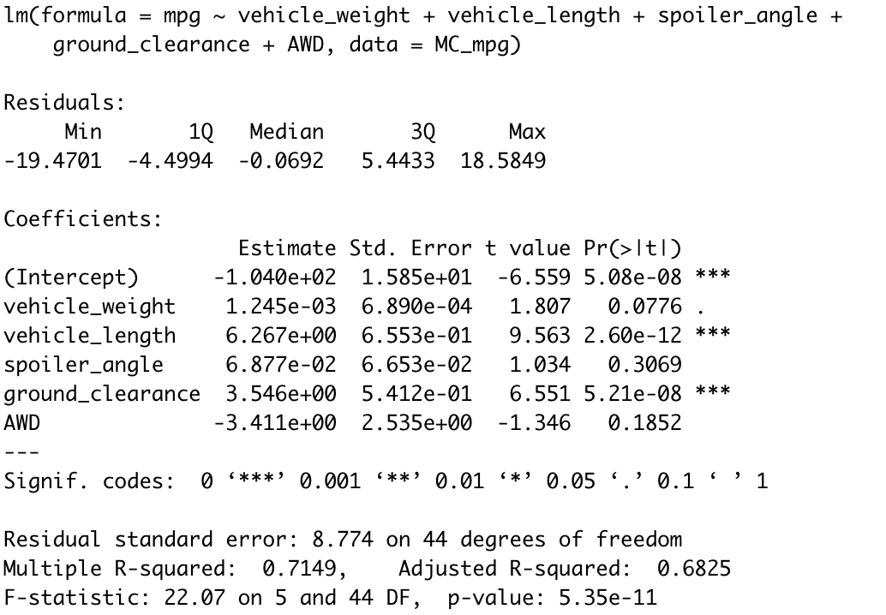
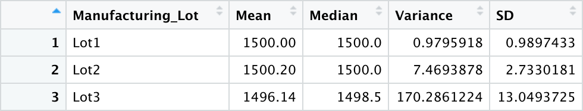

# MechaCar_Statistical_Analysis
R and Stats

## Linear Regression to Predict MPG

- Which variables/coefficients provided a non-random amount of variance to the mpg values in the dataset?
    - The variables with non-random variance as compared to miles per gallon (mpg) are ground clearance (p=5.21e-08) and vehicle length (p= 2.60e-12), with a significance level of 0.05.
- Is the slope of the linear model considered to be zero? Why or why not?
    - Due to the lower p-value of 5.35e-11 and r-squared at 0.7149, there is a very high correlation and it is unlikely that the slope of the data will be 0.
- Does this linear model predict mpg of MechaCar prototypes effectively? Why or why not?
    - Based on the correlation coefficient of the regression of 0.7149, the model is deemed a strong one for predicting mpg.

## Summary Statistics on Suspension Coils

#### Total Summary of PSI for Suspension Coils

#### PSI for Suspension Coils Subdivided by Lot

In the manufacturing process, the admissible variance for the PSI is 100. For our total suspension summary statistics, our data would pass this criteria with a variance of only 62. However when we group the information by lots, we find that the third manufacturing lot actually has a PSI above the permissible variance. Thus we could say that that lot fails manufacturing specifications.

## T-Tests on Suspension Coils

![t-test for Lot1][t-test_Lot1.png]

For Lot 1, the p-value = 1, which is high and means that the difference of the mean of the subset to the population is not statistically signficant.

![t-test for Lot2][t-test_Lot2.png]

For Lot 2, the p-value = 0.6072, which is high and means that the difference of the mean of the subset to the population is not statistically signficant.

![t-test for Lot3][t-test_Lot3.png]

For Lot 3, the p-value = 0.04168, which is low and means that the difference of the mean of the subset to the population **is** statistically signficant.

## Study Design: MechaCar vs Competition

One interesting study that can be performed to assess the MechaCar against the competition is taking a look at the correlation between fuel-efficiency and age of the vehicle. A car they can maintain fuel efficiency as it ages is going to be better suited for consumers who are comfortable buying a long-term vehicle.  Statistically, we are looking for a car that has a high correlation coefficient for fuel efficiency and years it has been driven and a slope that is higher for fuel efficiency over time.  Correlating these two data sets, we would hope to have a high correlation. The no hypothesis would be that there is no relationship between age and fuel efficiency, the alternative hypothesis would be that fuel efficiency changes with age. We would want our car not to have fuel efficiency change with age.  

